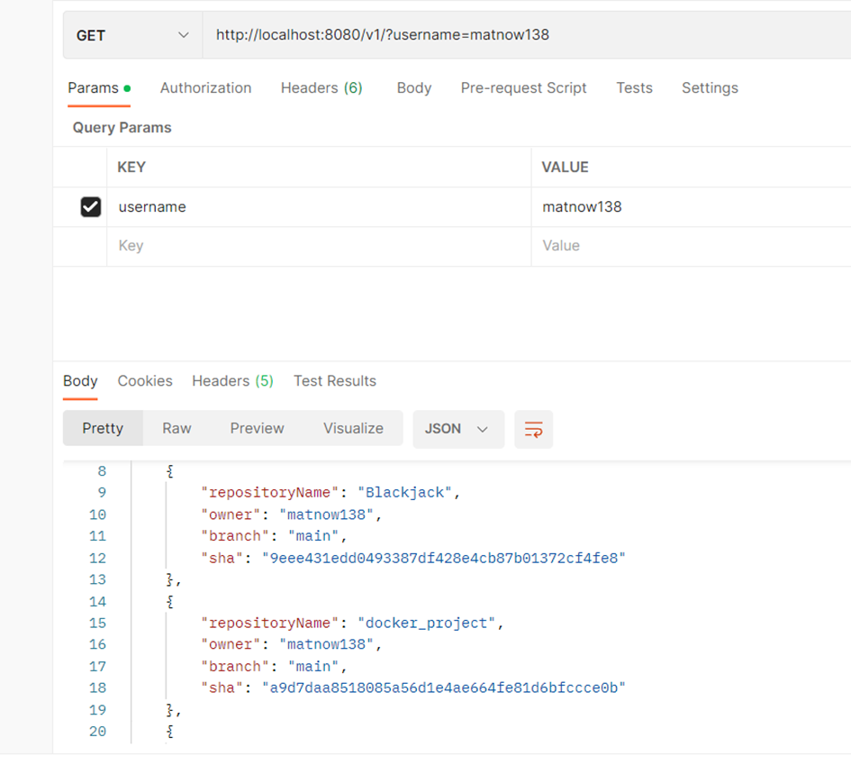
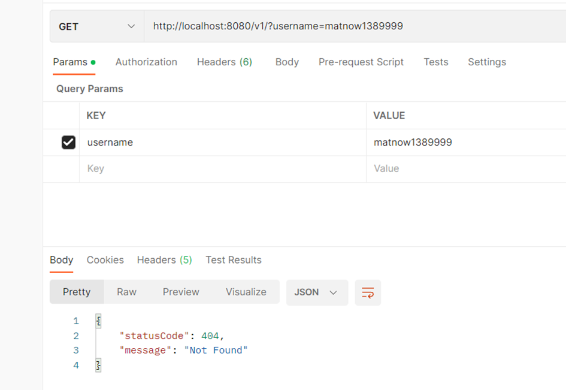

# **Atipera Task**

## Description

Atipera Task is a project that utilizes the GitHub API to retrieve a list of repositories that are not forks for a given username. It provides essential information about these repositories such as the owner and the last commit SHA, while excluding forked repositories from the list.

## Key Features

•	Retrieves a list of repositories for a given username.
•	Displays information including repository owner and last commit SHA.
•	Ignores forked repositories.

## Usage

1.	Build application – command : gradlew build
2.	Run the application – command java -jar .\build\libs\AtiperaTask-0.0.1-SNAPSHOT.jar
3.	Send a GET request to the following endpoint: localhost:8080/v1 using the desired username as the key.

## Examples

